# ddj resources

[Simon Wörpel](http://medienrevolte.de), Datenjournalist [@correctiv_org](https://correctiv.org)

## ddj
- Daten? Journalismus?
- Datenjournalismus?
- data driven journalismus?
- Daten-getriebener Journalismus?


### vormals: car
- "computer-assisted reporting"


### ein alter Hut?
> The Guardian, May 5, 1821
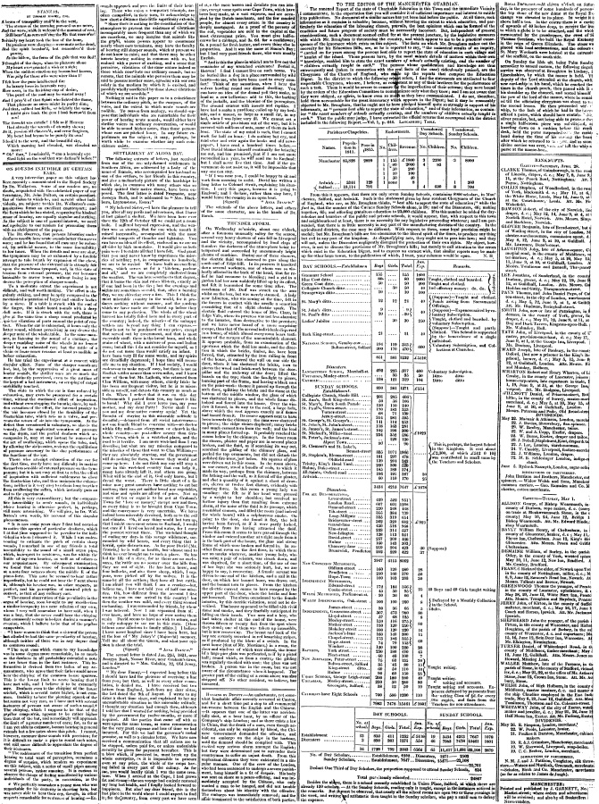


> 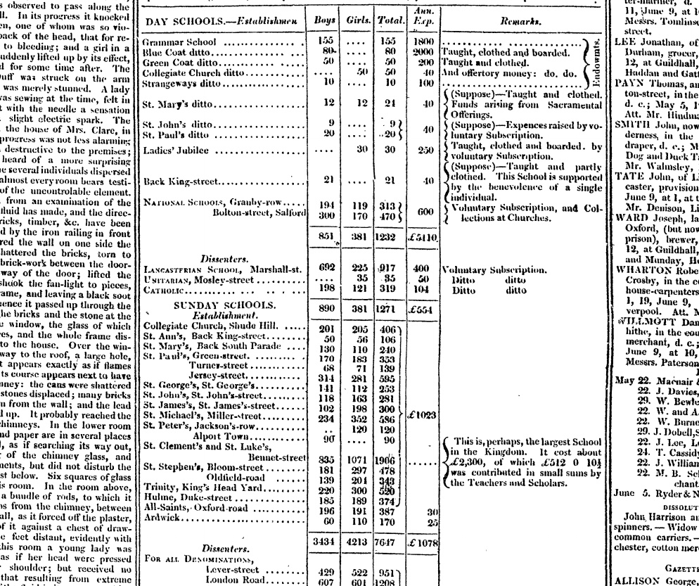


> 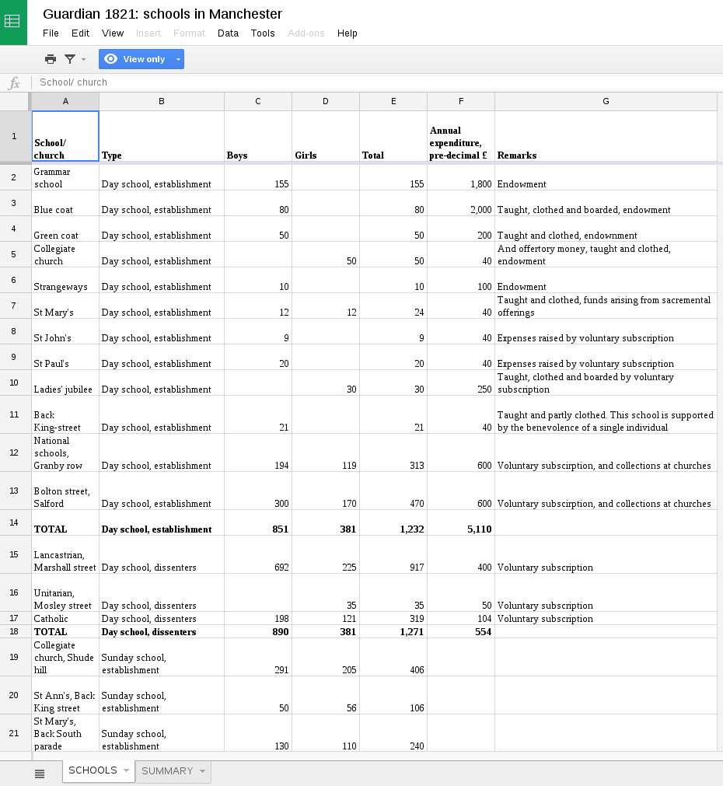


### noch früher
> [William Playfair](https://de.wikipedia.org/wiki/William_Playfair), 1759-1823
> Balkendiagramm
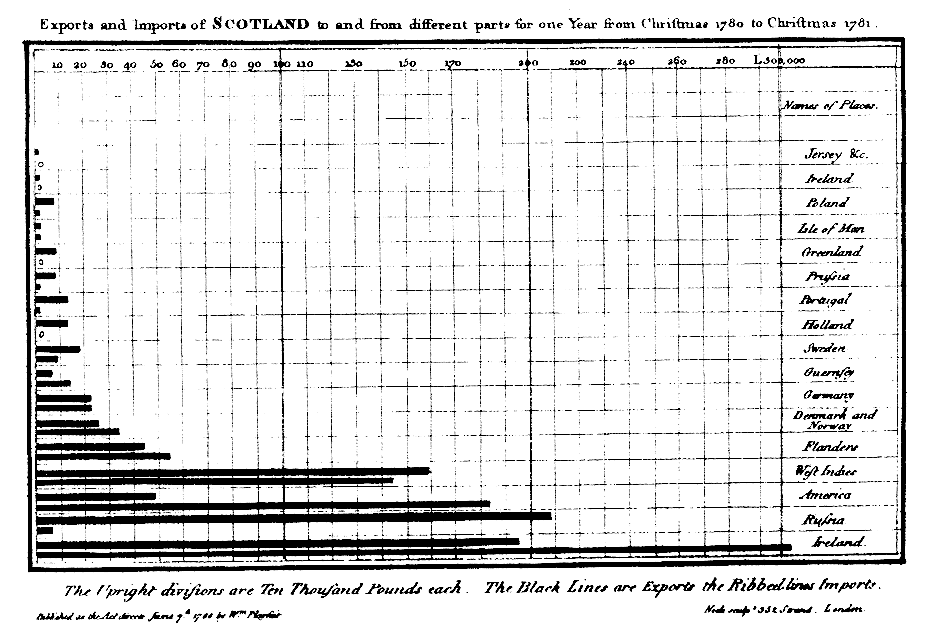


> Tortendiagramm


> Karte


> Kurvendiagramm


### und heute?


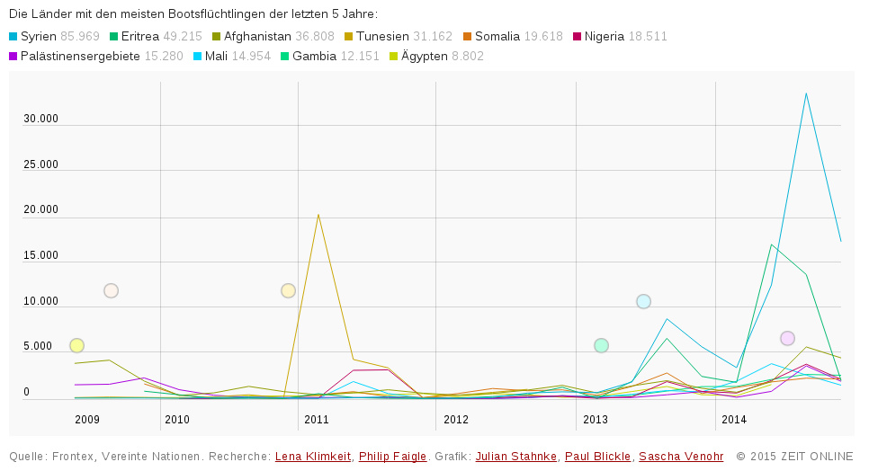


> Balkendiagramm
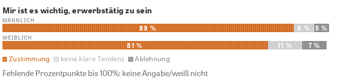


> Karte
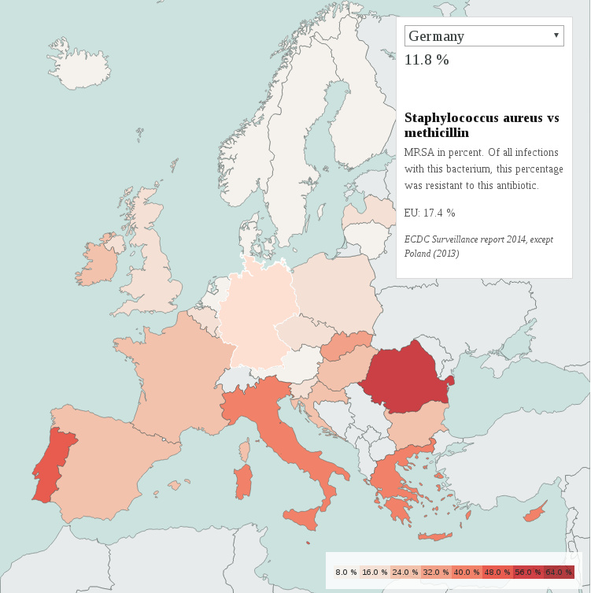


# Datenjournalismus
> "irgendwas mit Daten"<br>
[Wann fällt der erste Schnee?](http://www.spiegel.de/panorama/wetter-wann-faellt-in-deutschland-der-erste-schnee-a-1064475.html)


## data driven journalism
> "Daten-getriebener Journalismus"


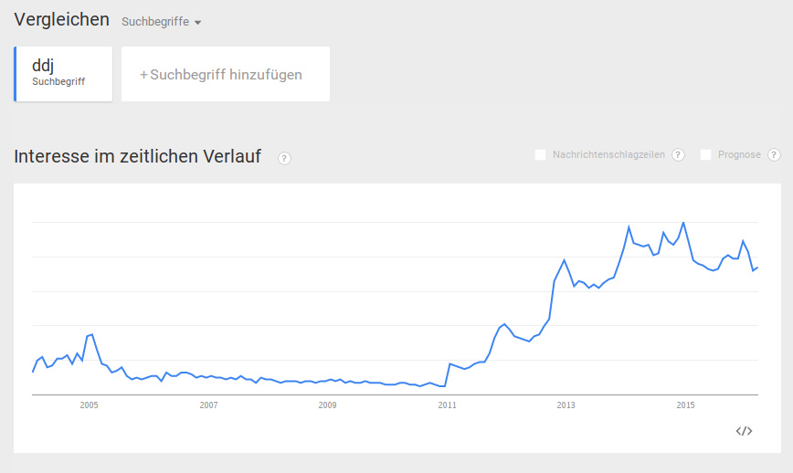


## ddj wird wichtiger
- Pulitzer Preis 2015
- Open Data Movement
- bedingt durch Digitalisierung:
  - neue Darstellungsformen
  - Heute sind Datengeschichten für viele Journalisten möglich, die noch vor wenigen Jahren nur Experten vorbehalten waren


## alles Daten?
> <small>Kind verletzt</small>
> ### Auto erfasst Jungen an der Ardeystraße
> *BRÜNNINGHAUSEN* Unfall auf einer der großen Kreuzungen des Dortmunder Südens: Ein Kind ist am Freitagnachmittag auf der Kreuzung Ardeystraße/Stockumer Straße von einem Auto angefahren worden.
> [Meldung](http://www.ruhrnachrichten.de/staedte/dortmund/polizei+in+dortmund./Kind-verletzt-Auto-erfasst-Jungen-an-der-Ardeystrasse;art2575,2968452)


## alles Daten!
key | value
----- | -----
Wo? | DO Brünninghausen,<br>Ardeystraße
Wann? | 11.03.16, 13.40 Uhr
Was? | Unfall, Kind von Auto angefahren
Wer? | Junge, Alter unbekannt
Wie? | Junge überquert Kreuzung
Warum? | Junge wollte Bus erwischen


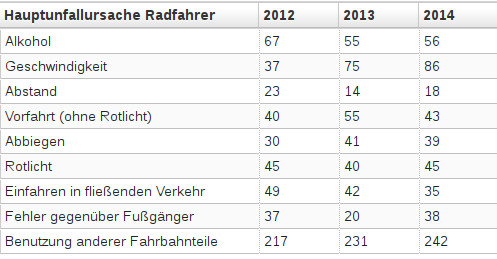

[Daten](http://www.offenedaten-koeln.de/dataset/33a0721f-6d94-436a-9988-15095b2473a8/resource/33a0721f-6d94-436a-9988-15095b2473a8)


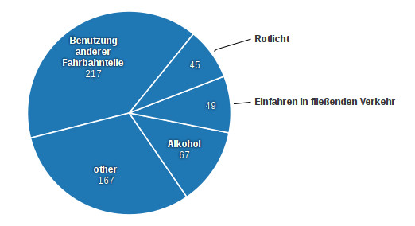


## alles Daten
- Mehr als Statistiken:
> heute kann *fast alles* mittels Zahlen erfasst & beschrieben werden

- Lebensläufe, Biografien
- Vorlieben, Gewohnheiten
- Soziale Verbindungen
- Medien


## Daten-getrieben
- Daten können überall mitspielen:
  - Themenfindung
  - Recherche
  - Veröffentlichung


# Beispiele


> <small>[2015 Pulitzer Prize, Public Service](http://www.pulitzer.org/winners/7224)</small><br>
> [Till Death Do Us Part](http://www.postandcourier.com/tilldeath/title.html)
> 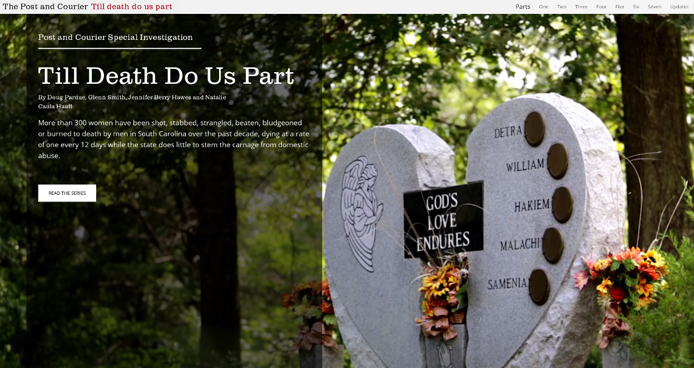
> <small>[The Post and Courier](http://www.postandcourier.com/), South California, USA


> <small>2012: Noch heute Referenz</small><br>
> [Snow Fall](http://www.nytimes.com/projects/2012/snow-fall/)
> 
> <small>[The New York Times](http://nytimes.com), NY, USA


> <small>Datenbanken zum Weiter-Recherchieren</small><br>
> [Euros für Ärzte](https://correctiv.org/recherchen/euros-fuer-aerzte/)<br>
> 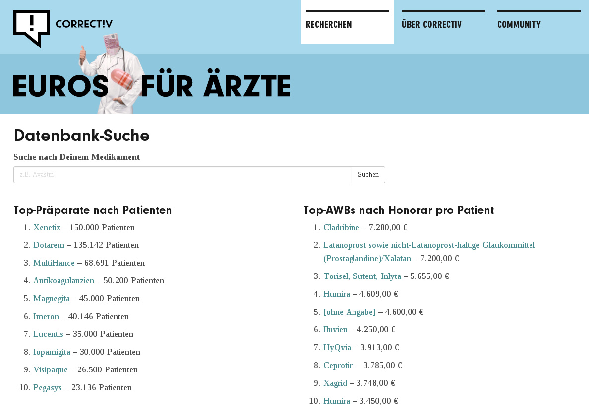
> <small>[correctiv.org](https://correctiv.org/), Berlin/Essen, Germany


> <small>komplexe Analyse</small><br>
> [The Tennis Racket](http://www.buzzfeed.com/heidiblake/the-tennis-racket)<br>
> 
> <small>[How they did it](http://www.buzzfeed.com/johntemplon/how-we-used-data-to-investigate-match-fixing-in-tennis#.wjblpBOL8)


# Themenfindung
- Wo kommen die Geschichten her?
- Wo kommen die Daten her?
- Was ist zuerst da?


# Daten => Thema


## Daten
*Unregelmäßigkeiten in Datensätzen*


## Daten-*journalismus*
- genau beobachten
- kritisch nachfragen
- eigene Schlüsse ziehen
- Befund -> These -> Story


## ddj-skills
Was wir sowieso die ganze Zeit machen & Spreadsheets


## erstmal genau beobachten
- Google Spreadsheets: "Erkunden-Modus"


## Statistik A
- Extremwerte / Ausreißer
- Korrelationen
- Verteilungen
- Regressionen


## verschiedene Blickwinkel
- lokale Filter
- Durchschnitte
- Summen
- Verhältnisse
- Vergleiche


## recherchieren
- Stimmt das mit offiziellen Aussagen überein?
- was sagen andere Datenquellen?
- selber nachrechnen
- [neue Spalten](https://correctiv.org/recherchen/stories/2016/05/02/maennlich-52-jahre-sucht-afd/)


## experimentieren
- Trends fortschreiben
- Verschneiden mit anderen Daten
- andere Skalierungen
- Zoom
- *alles ist erlaubt*
- [Exploring the 7 Different Types of Data Stories](http://mediashift.org/2015/06/exploring-the-7-different-types-of-data-stories/)


## experimentieren
> Wir sind Journalisten und keine Sozialwissenschaftler.


## Befragen
Jeder Kurvenverlauf hat einen Grund


## kritisch sein
> Daten als Quelle so behandeln, wie wir jede andere Quelle behandeln

- Warum erzählst du mir das?
- Wer ist der Absender?
- [Pressekodex](http://www.presserat.de/pressekodex/pressekodex/#panel-ziffer_2____sorgfalt)
- Nicht jede Visualisierung ist journalistisch relevant
- Rückschlüsse aus analysierten Daten prüfen:
  - Welche Methode erzeugt welche These?
- Achtung vor irreführendem Interpretationsspielraum!
  - durch uns Journalisten
  - durch die Leser


## Obacht!
> Abtreibungen
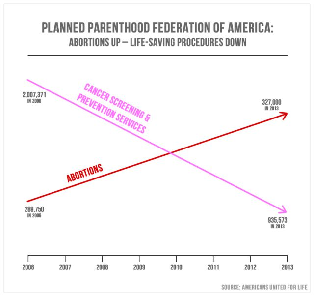


> normalisierte X-Achse:
> 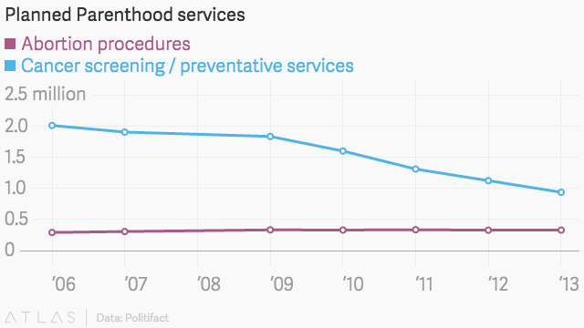


## Copy & Paste
- Es gibt immer eine klare Roadmap, meistens sogar transparent!

> [US Gun Deaths - Stolen Years](http://guns.periscopic.com/)


## Effizienz
- Daten mehrfach verwerten
- Sammelwut!
- Routinen anlegen (Q/H/J)


# Thema => Daten


## Gute Daten?
*was sind journalistisch interessante Daten?*


## Wo kommen Daten her?
- Statistik-Ämter / öffentliche Veröffentlichungen
- Open Data
- selbst generierte Daten
- selbst verschnittene Daten
- User generated data
- "befreite" Daten via Auskunftsrechte


## Scoup-Faktor
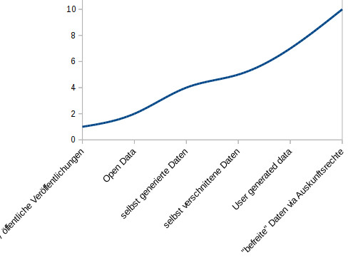


### "befreite" Daten
> [Harmsworth](https://de.wikipedia.org/wiki/Alfred_Harmsworth,_1._Viscount_Northcliffe)/[Hearst](https://de.wikipedia.org/wiki/William_Randolph_Hearst)/[Orwell](https://de.wikipedia.org/wiki/George_Orwell):
> Journalism is printing what someone else does not want printed, everything else is public relations


## Daten finden
[google](http://lmgtfy.com/?q=gesundheitsausgaben+deutschland+csv)


## Portale - Deutschland
- [OpenData-Portal Deutschland](https://www.govdata.de/)
- [Stat. Bundesamt – GENESIS](https://www-genesis.destatis.de/genesis/online)
- OD Portale der Länder, z.B. [open.nrw](https://open.nrw/de/dat_kat)
- [Offene Kommunaldaten](https://www.offenesdatenportal.de/)
- *Datenwüste Deutschland*


## Portale - EU
- [Open Data EU](https://open-data.europa.eu/de/data)
- [European Data Portal](http://www.europeandataportal.eu/en)
- [eurostat](http://ec.europa.eu/eurostat/de?cookies=disabled)


## Portale - international
- [OD Übersicht](http://dataportals.org/)
- [Open Spending](https://openspending.org/)
- [datahub (OKF)](https://datahub.io/dataset)


## Institutionen
- [UN Data](http://data.un.org/)
- [Weltbank Data](http://data.worldbank.org/)


## Forschungsdaten
- [UK Data Archive](http://data-archive.ac.uk/)
- Beispiel: [Deutsche Rentenversicherung](http://forschung.deutsche-rentenversicherung.de/ForschPortalWeb/)
- Verbände
- Gewerkschaften


## Qualitativ
- freebase.com -> [wikidata.org](https://www.wikidata.org/wiki/Wikidata:Main_Page)


# Meine Daten gibt es nicht.


## Anrufen
- Ämter, Behörden bzw. deren Fachabteilungen


## Scraping
- automatischer Download vieler Daten
- "herausextrahieren"
- [https://github.com/simonwoerpel/who-ebola-scraping](https://github.com/simonwoerpel/who-ebola-scraping)
- [ScraperWiki](https://scraperwiki.com/)


## crowdsourcing
https://crowdnewsroom.org
http://slides.com/sjockers/crowdnewsroom-ddjnrw#/


## Auskunftsrechte
- [IFG & LPG](https://correctiv.org/bildung/auskunftsrechte/)
- [FragDenStaat](https://fragdenstaat.de)
- [kleine Anfragen](https://kleineanfragen.de/)


# Visualisierung
> "Recherchieren durch gucken"

- nicht erst am Ende
- zeigen, wo man genauer hinschauen kann
- zeigen andere Themen/Ansätze
- zeigen Fallbeispiele
- helfen beim Validieren
- ausprobieren:
    - verschiedene Achsen-Kombinationen
    - X-Achse: 0
    - X-Achse: nicht 0
    - Skalierung


## Visualisierung - Formen
Typ | Zweck
----|------
Torte | Anteile
Balken | Verteilung / diskret
Kurve | Entwicklung / kontinuierlich
Karte | Ortsgebunden
Tabelle | Kategorien

> etwas anderes verstehen wir kaum

- Trade-Off: Gut verständlich, aber nicht zu langweilig


# Werkzeugkiste
- Recherche/Daten-Bearbeitung
- Visualisierung
- Coding?


## Typischer Workflow
1. Daten beschaffen / finden
2. Daten bereinigen, maschinenlesbar machen
3. Daten analysieren, *Geschichte finden*
4. Daten visualisieren und/oder Text dazu
5. Veröffentlichen
6. Feedback: Änderungen einarbeiten!


## Daten aus der Wildnis
typische Formate
- [json](http://www.json.org/json-de.html)
- [csv](https://en.wikipedia.org/wiki/Comma-separated_values)
- [geojson](http://geojson.org/)


key | value
----- | -----
Wo? | DO Brünninghausen,<br>Ardeystraße
Wann? | 11.03.16, 13.40 Uhr
Was? | Unfall, Kind von Auto angefahren
Wer? | Junge, Alter unbekannt
Wie? | Junge wollte Kreuzung überqueren
Warum? | Junge wollte Bus erwischen


## json
```json
{
  "wo": "DO Brünninghausen, Ardeystraße",
  "wann": "11.03.16, 13.40 Uhr",
  "was": "Unfall, Kind von Auto angefahren",
  "wer": "Junge, Alter unbekannt",
  "wie": "Junge wollte Kreuzung überqueren",
  "warum": "Junge wollte Bus erwischen"
}
```


## csv
- tabellarisch
- mit oder ohne Überschriften
- Zellentrenner (`delimiter`): `,`,`;`,`\t`, ...
```csv
wann,wo,was,wer
11.03.16,Brünninghausen,Unfall,Kind
11.03.16,Borsigplatz,Raubüberfall,"ältere Dame"
12.03.16,Eichlinghofen,Einbruch,"maskierte Männer"
```


# Verarbeitung


## PDF!?
- [https://spendengerichte.correctiv.org](https://spendengerichte.correctiv.org)
- [Sample Data](https://correctiv.org/media/investigations/justizgelder/data/nordrhein-westfalen/2013/justiz/justiz_nrw_2013.pdf)


## Tabula
> <small>PDF-Tabellen in maschinen-lesbare Form umwandeln</small>
> 


## Tabula
Daten aus pdf extrahieren
- "must have"
- [Download für Windows/Mac/Linux](http://tabula.technology/)
- funktioniert nicht bei eingescannten PDFs


## Eingescannte PDFs
- [Beispiel](http://gruene-fraktion-nrw.de/fileadmin/user_upload/ltf/Bilder/Themen/Rechtsextremismus/PMK_Rechts_und_antisemitische_Straftaten_2014_II.pdf)
- da hilft nur OCR, Optical Character Recognition (Optische Zeichenerkennung)
- leider kaum gute Freeware
- funktioniert gut (aber teuer): [ABBYY](http://www.abbyy.com/de-de/finereader/)


## Google Spreadsheets
> "Erkunden"
> 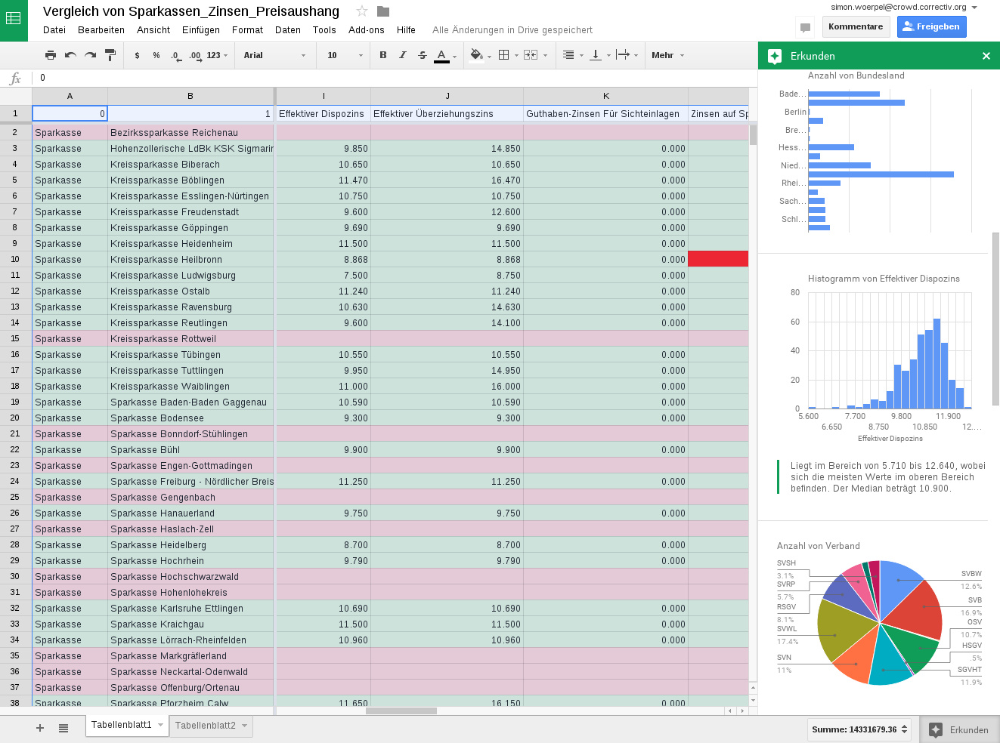


Vorteile | Nachteil
-----|-----
sehr intuitiv |
Excel für's Internet |
Erkunden-Modus |
Pivot Tables |
| **Google Inc.**
|
https://docs.google.com/spreadsheets/u/0/


# Visualisierung


## Google Fusion Tables
> beyond Excel
> 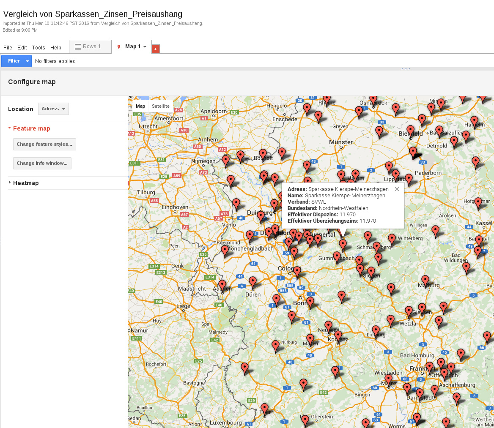


Vorteile | Nachteile
-----|-----
integriert |
Geocoding |
Veröffentlichen/<br>Einbetten |
mehr Features | weniger intuitiv
| **Google Inc.**
|
https://support.google.com/fusiontables/answer/2571232


## CartoDB
> schöne Karten selber bauen
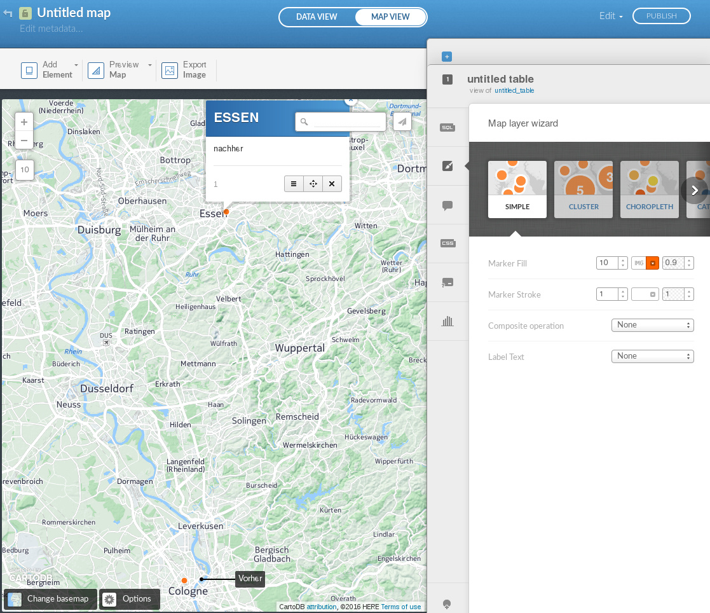


> 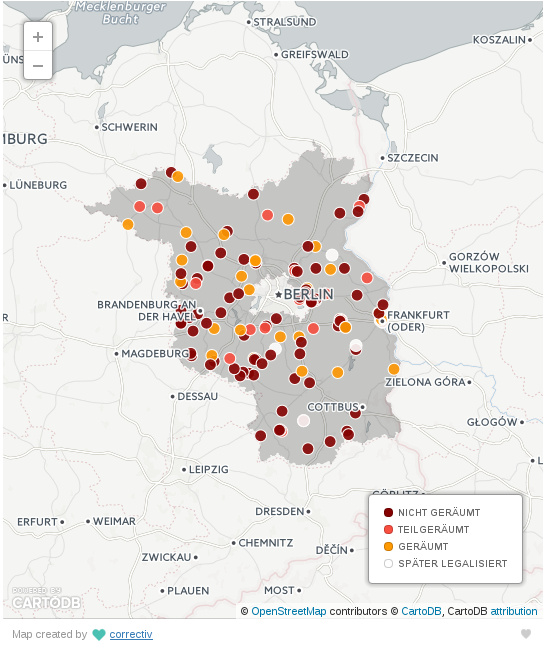


- viel schicker
- kostenfreie & Pro-Version
- [cartodb.com](https://cartodb.com)


## Mapbox
> für größere Vorhaben
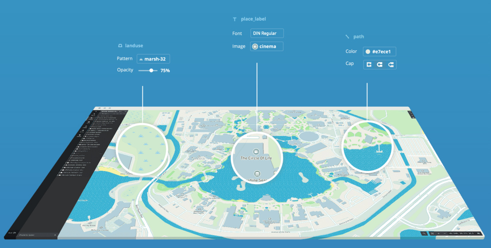


Vorteile | Nachteil
----- | -----
mehr Design möglich |
Mapbox-Studio |
| nur wenige Features<br>in free-Version


## Datawrapper
> Infografiken auf Knopfdruck
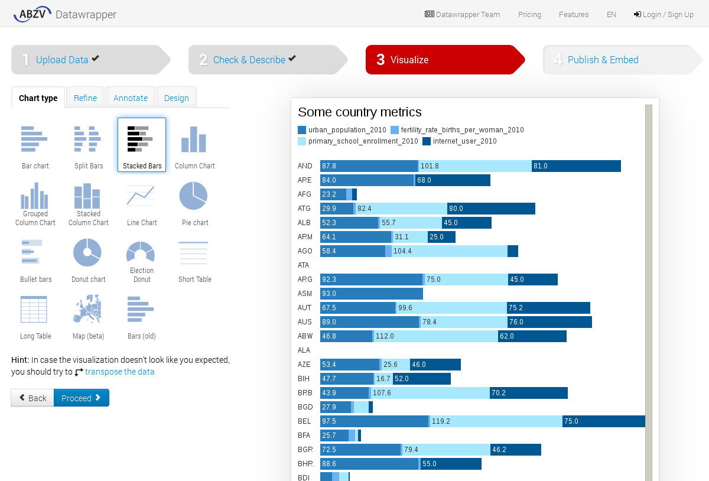

[datawrapper.de](https://datawrapper.de)

Vorteile | Nachteile
-----|-----
viele verschiedene<br>Grafik-Typen |
Veröffentlichen/<br>Einbetten |
sehr intuitiv | wenig customizable
| keine wirkliche<br>"Daten-Aufbereitung"
|


# Coding
- Beschaffung
- Analyse
- Aufbereitung/Visualisierung
- Veröffentlichung


## R
- https://www.rstudio.com/
- Statistik-Analyse
- gerade im Trend, top Lernkurve
- guter Einstieg als Skriptsprache
- RStudio als IDE, aus der direkt Datenvisualisierungen exportiert werden können


## javascript
- der Standard für Visualisierungen
- tausende Bibliotheken:
  - [d3](https://d3js.org/): Charts etc.
  - [leaflet](http://leafletjs.com/): Karten komplett selbst bauen


## python
- https://www.python.org/
- Datenanalyse
- komplette Web-Anwendungen
- Datenbanken
- Scraping (z.B. [Beautiful Soup](http://www.crummy.com/software/BeautifulSoup/bs4/doc/))


# Zum weiterlesen
- [Diving into Data Journalism: Strategies for getting started or going deeper](https://www.americanpressinstitute.org/publications/reports/strategy-studies/data-journalism/single-page/)
- [Junk Charts (datavis-Kritikblog)](http://junkcharts.typepad.com/junk_charts/)
- [My first steps into data journalism and datavis](https://dinfografia.wordpress.com/2016/03/10/my-first-steps-into-data-journalism-and-datavis/)
- [What I Use to Visualize Data](http://flowingdata.com/2016/03/08/what-i-use-to-visualize-data/)
- [Create maps in R in 10 (fairly) easy steps](http://www.computerworld.com/article/3038270/data-analytics/create-maps-in-r-in-10-fairly-easy-steps.html)
- [Using Excel to Do Precision Journalism](http://datadrivenjournalism.net/resources/using_excel_to_do_precision_journalism)
- [ddj @zeitonline](http://www.zeit.de/datenjournalismus)
- [OpenNews SOURCE](https://source.opennews.org/en-US/)
- [Top Ten #ddj: The Week’s Most Popular Data Journalism Links](http://gijn.org/2016/03/09/top-ten-ddj-the-weeks-most-popular-data-journalism-links-90/)
- [Storytelling with Google Maps](https://sites.google.com/site/geomedialab/)
- [The Quartz guide to bad data](http://qz.com/572338/the-quartz-guide-to-bad-data/)
- [How to be a data journalist](http://www.theguardian.com/news/datablog/2010/oct/01/data-journalism-how-to-guide)
- https://www.americanpressinstitute.org/publications/reports/strategy-studies/data-reporting-rise/
- http://towcenter.org/the-art-and-science-of-data-driven-journalism/
- https://dinfografia.wordpress.com/2016/03/10/my-first-steps-into-data-journalism-and-datavis/
- http://schoolofdata.org/courses/#DataFundamentals
- http://towcenter.org/wp-content/uploads/2014/05/Tow-Center-Data-Driven-Journalism.pdf
- https://sites.google.com/site/geomedialab/
- http://blog.chryswu.com/2016/03/08/nicar16-slides-links-tutorials-resources/
- https://dinfografia.wordpress.com/2016/03/10/my-first-steps-into-data-journalism-and-datavis/
- http://www.theguardian.com/world/ng-interactive/2015/aug/26/china-economic-slowdown-world-imports
- http://www.bpb.de/gesellschaft/medien/opendata/64055/was-sind-offene-daten?utm_content=buffer37ed9&utm_medium=social&utm_source=twitter.com&utm_campaign=buffer
- https://de.wikipedia.org/wiki/Datenjournalismus
- http://opendata-network.org/2010/04/data-driven-journalism-versuch-einer-definition/
- http://www.theguardian.com/data
- http://www.theguardian.com/news/datablog/2011/jul/28/data-journalism
